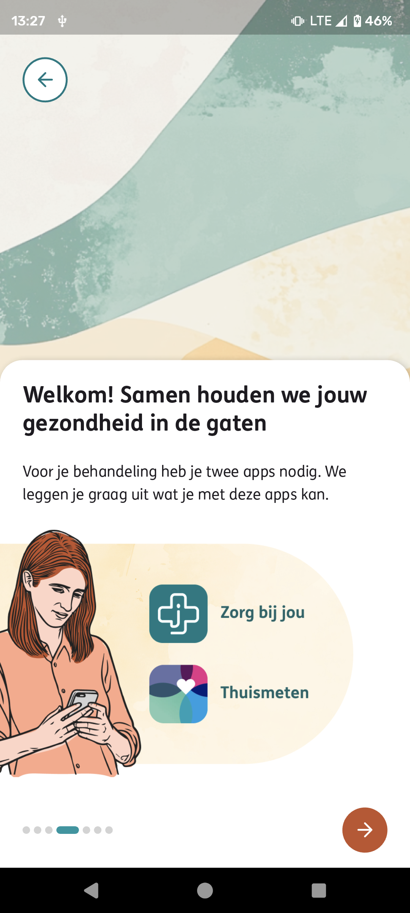
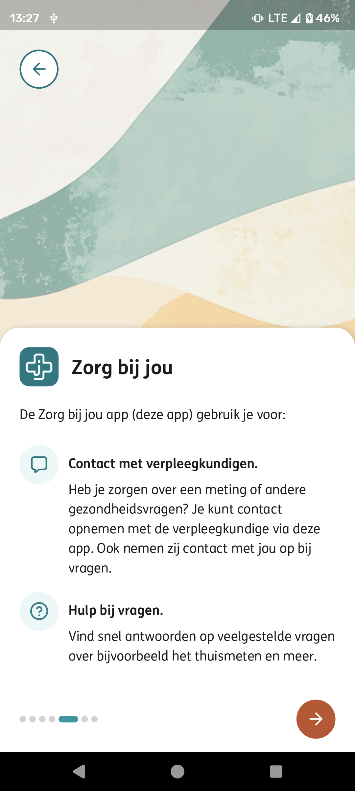
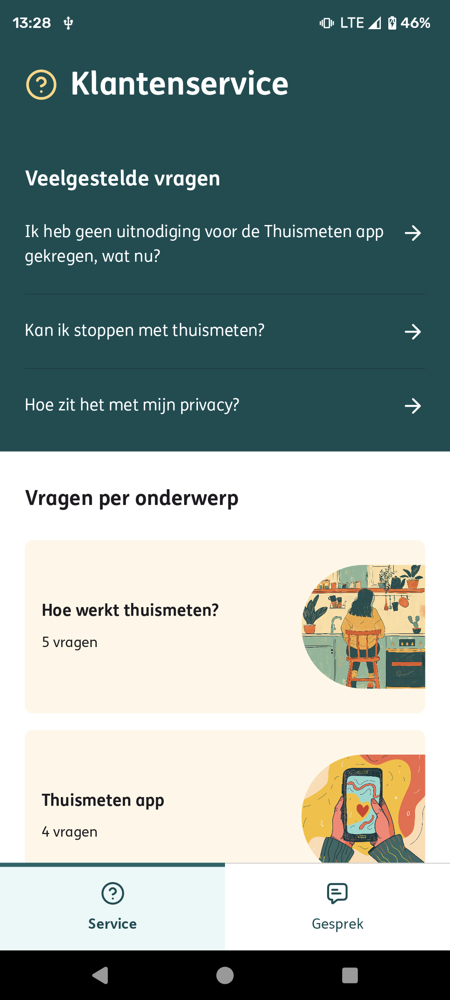
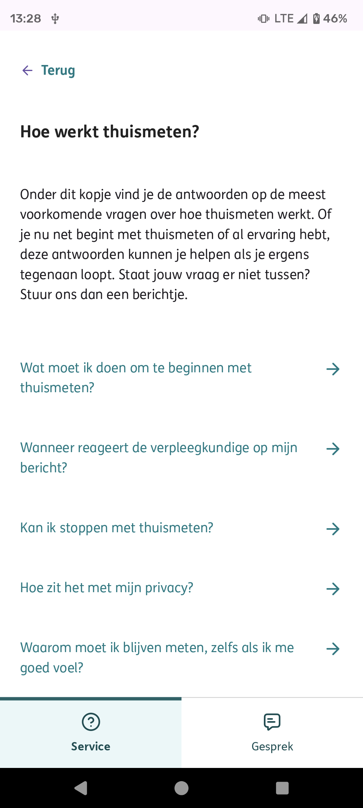
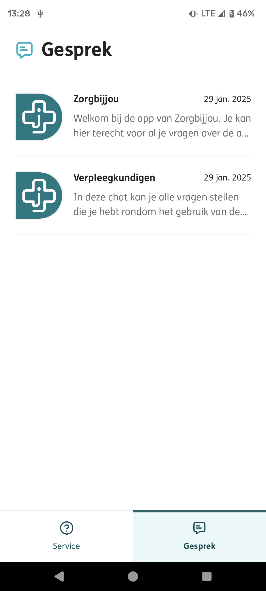
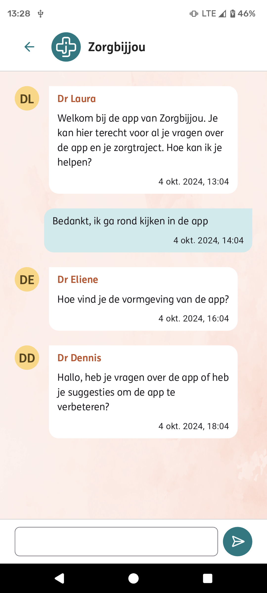

[](https://github.com/Zorgbijjou/Zorgbijjou-app-prototype/actions/workflows/zorg-bij-jou-app.yml)
[](https://sonarcloud.io/summary/new_code?id=zorgbijjou_app)

# Zorg bij jou App Prototype
The goal of the Zorg bij jou app is to improve the onboarding and inclusion of patients receiving hybrid care. The app provides patients with a digital platform to obtain information and communicate with healthcare providers. The prototype shows Zorg bij jou's vision of how the patient experience can be improved.

## Zorg bij jou App impression




## Getting started
The Zorg bij jou app is a Flutter project managed with Melos.
Widgetbook is implemented for developing Flutter widgets in isolation.

If you find any of this information to be outdated or unclear, feel free to fix it if you are able, alternatively you
can reach to Zorg bij jou. 

Before you can get started with development on the Zorg bij jou app you will need to install Chrome, the Flutter SDK and
Melos, follow the steps below to get ready.

### Chrome

The scripting is configured to work with chrome, if you don't have it installed already follow the
instructions [here](https://www.google.com/chrome/) to download and install Chrome

### Flutter

Follow the installation instructions for Flutter [here](https://docs.flutter.dev/get-started/install). If you're not
sure what app type to pick choose "Web" for your first app type. This is the most minimal installation and will allow
you to develop and test the app in a browser, other app types can be added later on. If you want to develop and test the
app on your mobile device pick the app type that suits your needs. Testing on iOS is only supported on Mac hardware,
Android development is supported on Windows, Mac and Linux.

### Melos

[Melos](https://melos.invertase.dev/) is a command-line tool that helps manage our Flutter projects with multiple
packages, this is very useful in monorepo style codebases like ours. Melos is developed with Dart so you will need to
follow the Flutter installation instructions listed above before you can install it. To install Melos open a terminal
and execute the following command:

```bash
dart pub global activate melos
```

### Bootstrap the project

Once you have Melos installed you will need to bootstrap the project with Melos. Open a terminal, change the working
directory to the directory containing this readme and run the following command:

```bash
melos bootstrap
```

### Run Build Runners

To run the build runners you can use the Melos script:

```bash
melos build-runner:build:all
```

Or in watch mode:

```bash
melos build-runner:watch:all
```

### Run the app

Run the app to test if everything went well:

```bash
melos run dev
```

This command might take a while, hang on while it takes care of compiling and building the Zorg bij jou app. Once it is
built it will serve the application on a server on your development machine and automatically open a Chrome browser with
the app. During development you will typically start the app with your debugger instead of this command.

## Development

The flutter documentation contains an explanation of how to develop on the codebase
with [Visual Studio Code](https://docs.flutter.dev/tools/vs-code)
and [IntelliJ or Android Studio](https://docs.flutter.dev/tools/android-studio). This documentation explains what
extensions to install, how to debug the app and more.

### Running

#### Run the Zorg bij jou app

To run the Zorg bij jou app you can use the Melos script:

```bash
melos run dev
```

This will start the app in a browser, you can also run the app on a mobile device by following the instructions in the
Flutter documentation.

## Linux

```shell
sudo apt install libsecret-1-dev libsecret-tools libsecret-1-0
```

#### Known Issues

Calling the endpoints from the PatientsBFF returns `ClientException: XMLHttpRequest error`. This is caused by chrome security settings. To fix this issue, follow the steps below:

1. Go to flutter\bin\cache and remove a file named: flutter_tools.stamp
2. Go to flutter\packages\flutter_tools\lib\src\web and open the file chrome.dart.
3. Find '--disable-extensions'
4. Add '--disable-web-security'

#### Run the Widgetbook app

We use Widgetbook to support development of our widgets in isolation, this not only improves structuring widgets and
code but also supports reviewing and testing by designers and product owners. Start Widgetbook with one of these Melos
scripts:

**On Windows:**

```bash
melos run widgetbook:win
```

**On Mac:**

```bash
melos run widgetbook:mac
```

**With chrome:**

```bash
melos run widgetbook
```

This will start Widgetbook as a native application, any modifications you make to the code will instantly be reflected
by Widgetbook.

### Localizations

To localize the app you can use the Melos script:

```bash
melos run l10n:generate
```

### Linting

To check your code for potential issues and proper formatting you can run the Melos lint script:

```bash
melos run lint
```

This should show issues that you will need to fix before submitting your code for a review, if you do not fix these your
pull request will not be accepted.
It runs the `format` and `analyze` command.

### Testing

#### Unit tests

To run unit tests for packages and their dependencies that have been modified on the current branch you can run the
Melos test script:

```bash
melos run test
```

If you want to run tests on all packages run the `test:all` script:

```bash
melos run test:all
```

### Building

We have several Melos scripts configured to help with building the application for different platforms.

#### Building for Web

To build the web version of the app, use the following command:

```bash
melos run build:web
```

This command will execute flutter build web

#### Building for Android

To build the Android version of the app, use the following command:

```bash
melos run build:android
```

This command will execute flutter build apk

#### Building for iOS

To build the iOS version of the app, use the following command:

```bash
melos run build:ios
```

This command will execute flutter build ipa

#### Building Widgetbook

To build the Widgetbook workspace, use the following command:

```bash
melos run build:widgetbook
```

This command will execute flutter build web --release --base-href "/widgetbook/" for the widgetbook_workspace scope.

### Logging

There are 2 different logging systems in place, one system that logs to the console and one system that logs to Azure Application Insights. The Application Insights logger requires an instrumentation key to be specified at build time as described [here](#run-the-zorg-bij-jou-app) if this key is not provided the Application Insights logger wil log a warning message and will then log nothing at all. Released apps are provided with an instrumentation key from an Azure Key Vault in the GitHub workflow when they are built.

#### Log levels

There are 4 standard log levels:

- **Fine:** Logs messages to the console, these messages are never logged in Application Insights. Use this for detailed debugging information that is useful during development but does not need to be logged to Application Insights
- **Info:** Logs messages to the console and traces to Application Insights. This level can be used to support tracing production issues.
- **Warning:** Logs messages to the console and traces to Application Insights. These messages stand out more and could be used to inform about situations that might be unexpected or a potential problem in an production environment.
- **Severe:** Logs messages to the console and errors to Application Insights. Use this log level to record events that are out of the ordinary and should be investigated by developers in production environments.

#### Analytics

We also use the logging system to report analytics data, these levels may be used to track user behavior:

- **Custom Event:** Tracks custom events regarding user interaction in Application Insights, these events are also logged to the console as **Info** level messages. Examples of custom events are "App started", "Language selected", "Measurement received".
- **Pageview:** Tracks pageviews in Application Insights, these events are also logged to the console as **Info** level messages. All navigation with the router is already logged automatically as pageviews.

#### Log helpers

For each log level there's a helper method that allows for easy logging from anywhere in the codebase. To use these methods you only need to import the core module: ``

```dart
import 'package:core/core.dart';

fine('Category','Some fine log message');
info('Category','Some info log message');
warning('Category','Some warning log message');
severe('Category','Some severe log message');
customEvent('App Started', {'key':'value'});
pageview('My awesome page', {'key':'value'}, '/my-awesome-page');

/*
Produces the following messages:
2024-09-20T07:27:17.481Z [FINE] [Category] Some fine log message
2024-09-20T07:27:17.481Z [INFO] [Category] Some info log message
2024-09-20T07:27:17.481Z [WARN] [Category] Some warning log message
2024-09-20T07:27:17.481Z [SEVERE] [Category] Some severe log message
2024-09-20T07:27:17.481Z [INFO] [Custom event] App Started: {key: value}
2024-09-20T07:27:17.481Z [INFO] [Pageview] My awesome page - /my-awesome-page - {key: value}
*/
```

### Updating Tokens

To update tokens using Figma, use the following command:

```bash
melos run tokens:update
```

This command will execute figma2flutter for the theme scope.

### Updating localization classes

After editing any `.arb` localization file the localization dart classes need to be re-generated to reflect the changes:

```bash
melos run l10n:generate
```

### Updating icons from the Figma Design System

1. Locate the icons in Figma, you can find them [here](https://www.figma.com/design/QJWSQHNXxjqLGUKwxtOKzo/Pill-Fundamentals?node-id=175-855&t=DFxwpOQr8N8Li8Hs-4)
1. Shift-select all icons
1. The inspector should show a control with a button `Export [x] layers`, the dropdown above it should read `SVG`. Click the export button, this should trigger a download of a zip containing all SVG files
1. Unzip the downloaded zip somewhere, you should now have all SVGs in a single directory.
1. The SVG files have the icons encoded as strokes, to generate the font we need outlines. [Iconly](https://iconly.io/tools/svg-convert-stroke-to-fill) can help us do that. Select all the file on your local disk and drag them to the Iconly file picker.
1. Click the `Convert Strokes to Fills` button. This will trigger a download of a zip file containing the same SVG files but they are encoded as outlines now.
1. Unzip the downloaded zip somewhere.
1. Now we will use [FlutterIcon](https://www.fluttericon.com/) to generate a font and dart code with constants that help us use the icons in our code. Drag all the SVG files to [Fluttericon](https://www.fluttericon.com/).
1. Select all the icons that were uploaded
1. Click the `Download` button, this will trigger the download of yet another zip containing the generated font and the dart code.
1. Unzip the zip somewhere.
1. Overwrite the [font file asset](./packages/theme/fonts/CustomIcons.ttf) with the downloaded font file.
1. Replace the contents of [custom_icons.dart](./packages/theme/lib/assets/icons/custom_icons.dart) with the contents of the downloaded dart file. This will need some modifications:
   - Format the code with `melos format`
   - Add the following line to the top of the file: `// ignore_for_file: constant_identifier_names`
   - The generated comment block will trigger an analyzer warning, replace the `///` commend markers with `/*` comment markers

#### End-to-end tests

At the moment there are no e2e tests
